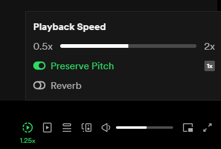

# Spotify remix

This project is a modified clone of [this repository](https://github.com/rnikko/spotify-playback-speed).

This is a Chrome Extension that allows user to manipulate Spotify's web playback. I cleaned it up a little and added reverb (reverb impulse file can be changed in background.ts , for now I use a free bathroom reverb impulse from [there](https://cdn.freesound.org/previews/192/192294_3276562-lq.mp3)).

Features:

 - set playback rate
 - set preserve pitch
 - set reverb

# Stack

 - TypeScript
 - Webpack

## Guide

1. npm run build
2. navigate to chrome://extensions/
3. load unpacked content of dist folder

## Notes

It may be possible to run it in Spotify's desktop app by using [Spicetify](https://github.com/spicetify/spicetify-cli), but for now there is an issue with finding the player element because of the way their extensions are loaded into Spotify.